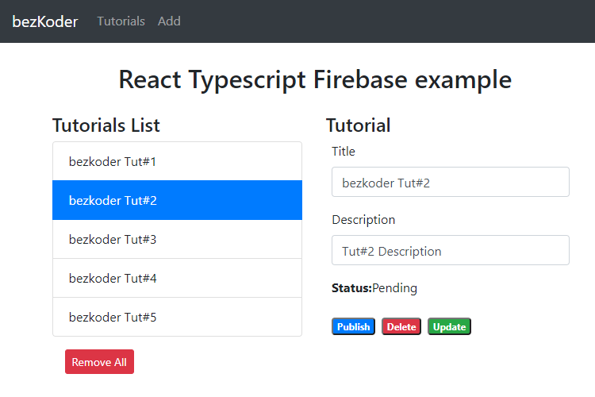

# React Typescript Firebase example: CRUD with Realtime Database

Build a React Typescript and Firebase Realtime Database CRUD example with Router & Bootstrap 4.

It is the React Tutorial Application in that:
- Each Tutorial has id, title, description, published status.
- We can create, retrieve, update, delete Tutorials.



For instruction, please visit:
> [React Typescript Firebase example: CRUD App](https://www.bezkoder.com/firebase-typescript-react/)

Related Posts:
> [React Typescript Firestore example: CRUD App](https://www.bezkoder.com/react-typescript-firestore/)

> [React Typescript example Project with Axios and Web API](https://www.bezkoder.com/react-typescript-axios/)

> [React Hooks Typescript example Project with Axios and Web API](https://www.bezkoder.com/react-typescript-api-call/)

> [React (Javascript) CRUD example to consume Web API](https://www.bezkoder.com/react-crud-web-api/)

> [React Redux CRUD App example with Rest API](https://www.bezkoder.com/react-redux-crud-example/)

> [React (Hooks) CRUD example to consume Web API](https://www.bezkoder.com/react-hooks-crud-axios-api/)

> [React Table example: CRUD App with react-table v7](https://www.bezkoder.com/react-table-example-hooks-crud/)

Using Material UI instead of Bootstrap:
> [React Material UI examples with a CRUD Application](https://www.bezkoder.com/react-material-ui-examples-crud/)

More Practice:
> [React Pagination example](https://www.bezkoder.com/react-pagination-material-ui/)

> [React File Upload example](https://www.bezkoder.com/react-file-upload-axios/)

> [React JWT Authentication & Authorization example](https://www.bezkoder.com/react-jwt-auth/)

> [React + Redux: JWT Authentication & Authorization example](https://www.bezkoder.com/react-redux-jwt-auth/)

Fullstack with Node Express:
> [React + Node Express + MySQL](https://www.bezkoder.com/react-node-express-mysql/)

> [React + Node Express + PostgreSQL](https://www.bezkoder.com/react-node-express-postgresql/)

> [React + Node Express + MongoDB](https://www.bezkoder.com/react-node-express-mongodb-mern-stack/)

Fullstack with Spring Boot:
> [React + Spring Boot + MySQL](https://www.bezkoder.com/react-spring-boot-crud/)

> [React + Spring Boot + PostgreSQL](https://www.bezkoder.com/spring-boot-react-postgresql/)

> [React + Spring Boot + MongoDB](https://www.bezkoder.com/react-spring-boot-mongodb/)

Fullstack with Django:

> [React + Django Rest Framework](https://www.bezkoder.com/django-react-axios-rest-framework/)

Integration (run back-end & front-end on same server/port)
> [Integrate React with Spring Boot](https://www.bezkoder.com/integrate-reactjs-spring-boot/)

> [Integrate React with Node Express](https://www.bezkoder.com/integrate-react-express-same-server-port/)


This project was bootstrapped with [Create React App](https://github.com/facebook/create-react-app).

### Set port
.env
```
PORT=8081
```

## Project setup

In the project directory, you can run:

```
npm install
# or
yarn install
```

or

### Compiles and hot-reloads for development

```
npm start
# or
yarn start
```

Open [http://localhost:8081](http://localhost:8081) to view it in the browser.

The page will reload if you make edits.